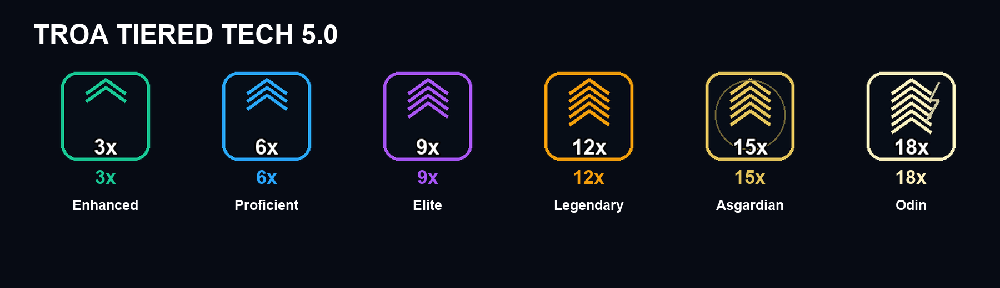
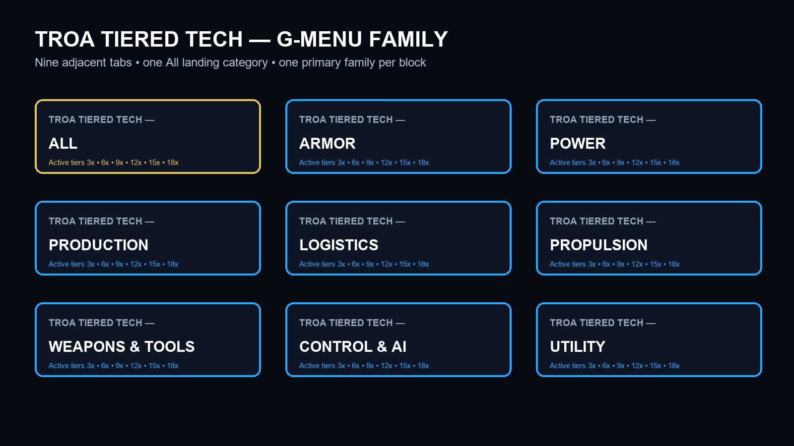

# TROA Tiered Tech 5.0

TROA Tiered Tech 5.0 is under development for Space Engineers. The planned progression expands eligible functional blocks and light/heavy armor from Enhanced 3x through the new Asgardian 15x and Odin 18x tiers.

## Important development notice

- Version 5.0 is under development.
- No public build is currently available.
- Source code and game definitions are private.
- No downloadable package, Steam Workshop release, or other release has been authorized.

This public repository contains player-facing documentation, approved PNG artwork, compatibility notes, the roadmap, and development updates only. It intentionally contains no SBC definitions, scripts, models, DDS assets, generators, manifests, saves, logs, executables, archives, Workshop IDs, or private repository links.

## Active tiers

| Tier | Technology | Intended role |
|---:|---|---|
| 3x | Enhanced | Entry active tier |
| 6x | Proficient | Advanced production and performance |
| 9x | Elite | High-tier engineering |
| 12x | Legendary | Endgame foundation |
| 15x | Asgardian | Efficient endgame technology |
| 18x | Odin | Final maximum-output tier |

Functional blocks receive fixed 3x protection. Armor protection scales with its active tier from 3x to 18x.

## Menu organization

Space Engineers uses flat G-menu category tabs, so the mod presents one contiguous category family:

- TROA Tiered Tech — All
- TROA Tiered Tech — Armor
- TROA Tiered Tech — Power
- TROA Tiered Tech — Production
- TROA Tiered Tech — Logistics
- TROA Tiered Tech — Propulsion
- TROA Tiered Tech — Weapons & Tools
- TROA Tiered Tech — Control & AI
- TROA Tiered Tech — Utility

See the [roadmap](ROADMAP.md), [tier reference](docs/TIERS.md), and [compatibility notes](docs/COMPATIBILITY.md) for more information.
